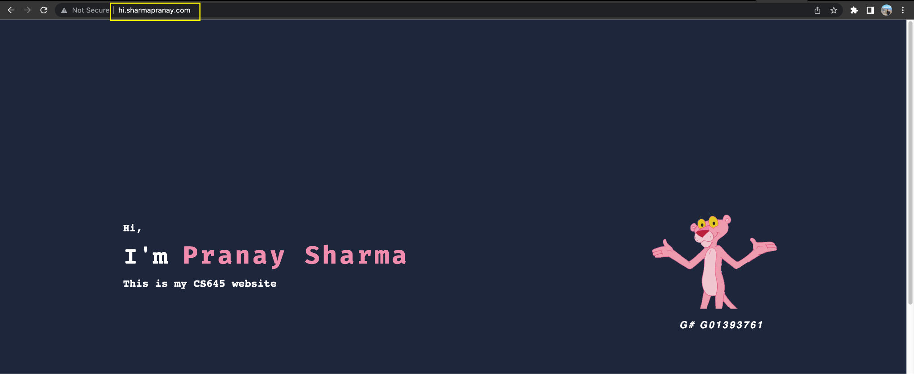

## Report: Domain name and AWS Route53

### Introduction: 
This report, outlines the detailed process of setting up my website using my domain name 'sharmapranay.com' and hosting it on an EC2 instance running Apache2 using AWS Route53 hosted zone.

Step 1: Purchase a domain name
The first step in setting up a website is to purchase a domain name from a domain registrar such as GoDaddy.com. In this case, I purchased the domain name 'sharmapranay.com' from GoDaddy.

Step 2: Create a hosted zone in AWS Route53
After purchasing the domain name, the next step is to create a hosted zone in AWS Route53. This can be done by following these steps:
1. I logged in to the AWS Learners Lab Console and navigated to the Route53 dashboard.
2. I clicked on "Create Hosted Zone" and entered the domain name that I had purchased from the domain registrar.
3. I clicked on "Create" to create the hosted zone.

Step 3: Update the nameservers at the domain registrar
Once the hosted zone was created, I updated the nameservers in the domain registrar to point to the AWS Route53 hosted zone. This can be done by following these steps:
1. I logged in to my GoDaddy account.
2. I found the domain name that I had purchased and clicked on "Manage DNS".
3. I updated the nameservers by adding the nameservers of the AWS Route53 hosted zone.
4. I saved the changes.

Step 4: Launch an EC2 instance with Ubuntu server and install Apache2
To host a website, an EC2 instance running Apache2 must be launched. In this case, I launched an EC2 instance with Ubuntu server, and Apache2 was installed by following these steps:
1. I logged in to the AWS Management Console and navigated to the EC2 dashboard.
2. I clicked on "Launch Instance" and selected Ubuntu server.
3. I followed the prompts to configure the instance.
4. I connected to the instance via SSH and installed Apache2 by running the command "sudo apt-get install apache2".

Step 5: Transfer website files to the EC2 instance
Once the EC2 instance was up and running with Apache2 installed, I transferred the website files to the EC2 instance. This can be done by following these steps:
1. I connected to the instance via SSH.
2. I transferred the website files to the "/var/www/html/" directory on the instance using the command "scp".

Step 6.1: Create a subdomain A record in the AWS Route53 hosted zone
To point the website to the EC2 instance using the public IP address, a subdomain record must be created in the AWS Route53 hosted zone. This can be done by following these steps:
1. I navigated to the AWS Route53 dashboard and clicked on the hosted zone that I had created earlier.
2. I clicked on "Create Record Set" and entered the subdomain name, in this case, "home.sharmapranay.com".
3. I selected "A - IPv4 address" for the record type.
4. I entered the IP address of the EC2 instance in the "Value" field.
5. I clicked on "Create" to create the subdomain record.

Step 6.2: Create a subdomain Alias record in the AWS Route53 hosted zone
To point the website to the EC2 instance using the Public IPv4 DNS, a subdomain record must be created in the AWS Route53 hosted zone. This can be done by following these steps:
1. I navigated to the AWS Route53 dashboard and clicked on the hosted zone that I had created earlier.
2. I clicked on "Create Record Set" and entered the subdomain name, in this case, "hi.sharmapranay.com".
3. I selected "CNAME" for the record type.
4. I entered the public DNS for the EC2 machine.
5. I clicked on "Create" to create the subdomain record.

Step 7: Verify website is live
To confirm that the website is live, I visited the subdomain in a web browser. In this case, visiting "hi.sharmapranay.com" and "hello.sharmapranay.com" displayed the website that I had transferred to the EC2 instance.

Step 8: Create an Application Load Balancer:
To handle increased traffic to our website, we created another EC2 instance using the same process as in Step 4 and transferred the website files using Step 5. We then created an Application Load Balancer using the following steps:
1. We navigated to the Load Balancers section in the EC2 dashboard.
2. We clicked on "Create Load Balancer" and selected "Application Load Balancer".
3. We selected the VPC that our EC2 instances were running in and created a new security group for the load balancer.
4. We configured the load balancer to listen on port 80, which is the default port for HTTP traffic.
5. We created a target group containing the two EC2 instances that we had created and added them as targets.
6. We completed the load balancer creation process and verified that it was successfully created.

Target Group:

Load Balancer:

Step 9: Create a record with an alias to the Application Load Balancer:
To make the load balancer accessible via a subdomain, we created a record in our AWS Route53 hosted zone with an alias to the Application Load Balancer. The following steps were taken:
1. We navigated to the AWS Route53 dashboard and selected the hosted zone that we had created earlier.
2. We clicked on "Create Record Set" and entered "645lb" as the subdomain name.
3. We selected "A - IPv4 address" for the type of record.
4. We selected "Yes" for "Alias" and chose the load balancer that we had created in Step 8.
5. We completed the record creation process and verified that it was successfully created.

Step 10: Verify the subdomain points to both instances:
To confirm that the subdomain "645lb.sharmapranay.com" points to both instances, we updated the index.html file on each instance to include a unique identifier. We then visited the subdomain in a web browser and confirmed that the unique identifier was displayed from both instances, indicating that the load balancer was successfully distributing traffic to both instances.

### Conclusion:
By following these steps, we have successfully set up a website hosted on an EC2 instance, which is accessible through a subdomain. Additionally, we have created an Application Load Balancer in AWS EC2 which allows for load balancing between multiple instances of the website. Overall, this setup provides a scalable and highly available solution for hosting a website on AWS.